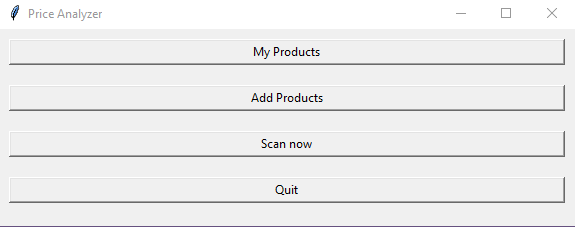
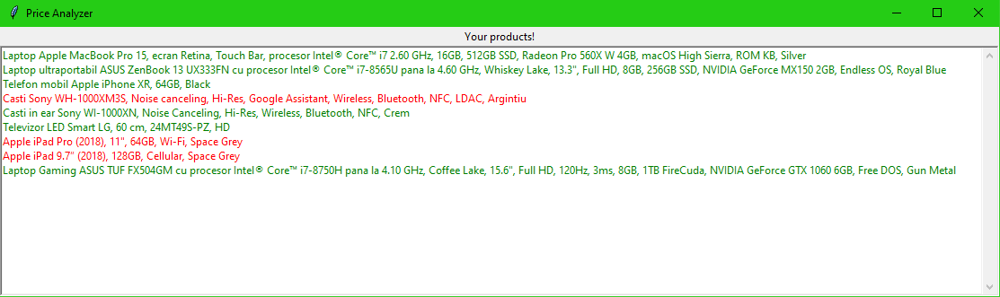
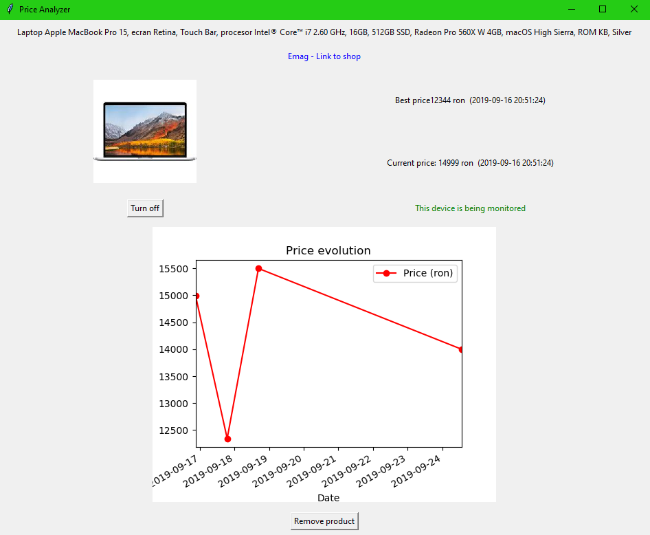
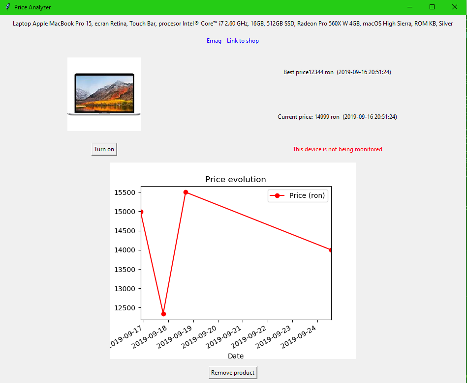
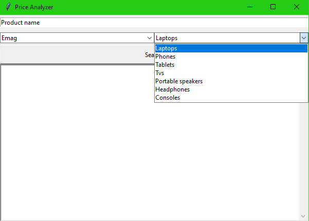
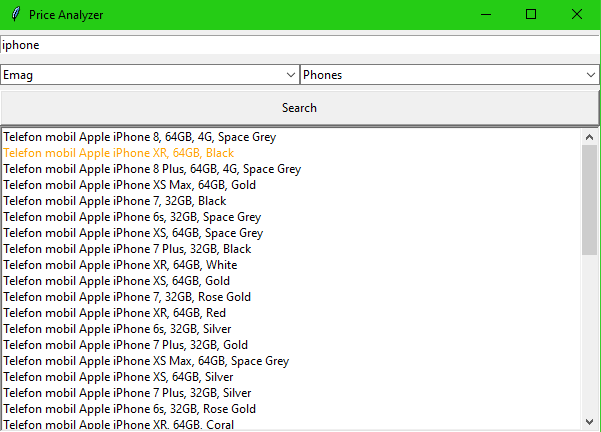
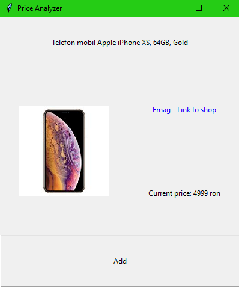

PriceAnalyzer
=============

Straightforward desktop application with a minimalist GUI that lets the user
track the evolution of any product's prices (www.emag.ro only).

## How does it work?

It makes HTTP requests to www.emag.ro, parses the response and saves the information inside MongoDB.

## UX

When opening the application the main menu appears, containing 4 buttons:
- **My Products:** shows the saved products
- **Add Products:** opens a search menu where the user can add new products
- **Scan now:** performs a scan for the latest prices on all the saved products (only the ones that are being traced, we will come back to this detail later on)
- **Quit:** closes the application

### My products Menu

It shows all of the saved products. There are **2 types** of saved products:
- **Traced (green):** whenever a scan is performed, its price will be updated
- **Untraced (red):** its price will not be updated

By double clicking any product the details are brought up.

For instance, if we double click on _"Laptop Apple MacBook Pro 15..."_ the following menu will appear:

The graph makes it very easy for the user to  have a solid grasp of the way the prices have fluctuated.

The current and best prices are showed in the top right corner, along with their dates (the current price is considered to be the last one that was scanned).

If the user is no longer interested in the product he can delete it or just stop tracing it's price by pressing "Turn off" button.

If the "Turn off" button is pressed, the following happens:

And if the user changes his mind he can easily turn back on the tracing by pressing "Turn on".

### New products menu

Whenever the user wants to add a new product, he can easily just enter the "Add Products" menu, enter the name of the product, choose a category (e.g. Phones, Laptops, etc.) and press "Search".

The products are loaded into a list. If a product is marked in yellow that means that the product is already saved.

By double clicking any product, a new window containing the picture and the link of the product is brought up.

The user only needs to click "Add" and the products is saved, along with it's current price.

## Technologies used
- Python + Tkinter
- MongoDB
